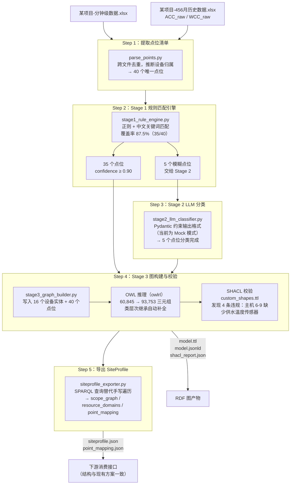

# Brick 语义层 Demo

基于《Brick语义层升级技术方案》实现的端到端演示项目。

将冷水机房 BAS 点位数据通过**三阶段混合管线**，自动映射为标准 Brick Schema RDF 图谱，并导出供下游消费的 SiteProfile JSON 接口。

---

## 项目概述

本 Demo 覆盖技术方案的核心路径：

- **输入**：原始 Excel 点位数据（BAS 导出）
- **Stage 1**：规则匹配引擎，基于中文关键词+正则，零 LLM 成本覆盖约 87% 的点位
- **Stage 2**：LLM 分类（当前为 Mock 模式），处理语义模糊的剩余点位
- **Stage 3**：Brick RDF 图构建 → OWL 推理 → SHACL 声明式校验
- **输出**：标准化 TTL / JSON-LD 图文件 + SiteProfile JSON

---

## 目录结构

```
BrickSchema/
├── data/                              # 原始 BAS 数据（Excel）
│   ├── 某项目-分钟级数据.xlsx
│   ├── 20240529_某项目-数据.xlsx
│   └── 某项目-456月历史数据.xlsx
│
├── demo/                              # 管线代码
│   ├── run_demo.py                    # 入口：一键运行全管线
│   ├── parse_points.py                # Step 1：从 Excel 提取点位清单
│   ├── stage1_rule_engine.py          # Step 2：规则匹配引擎
│   ├── stage2_llm_classifier.py       # Step 3：LLM 分类（含 Mock 模式）
│   ├── stage3_graph_builder.py        # Step 4：RDF 图构建 + OWL 推理 + SHACL 校验
│   ├── siteprofile_exporter.py        # Step 5：SPARQL 查询 → SiteProfile 导出
│   └── output/                        # 运行产物（自动生成）
│       ├── point_list.json
│       ├── stage1_results.json
│       ├── stage2_results.json
│       ├── model.ttl
│       ├── model.jsonld
│       ├── shacl_report.json
│       ├── siteprofile.json
│       └── point_mapping.json
│
├── shapes/
│   └── custom_shapes.ttl              # 冷水机房专属 SHACL 校验规则
│
├── requirements.txt
└── README.md
```

---

## 环境搭建

**要求**：Python 3.10+

```bash
pip install -r requirements.txt
```

`requirements.txt` 包含：

| 包 | 版本 | 用途 |
|----|------|------|
| `brickschema` | 0.7.9 | Brick 本体加载、RDF 图操作 |
| `rdflib` | ≥7.0 | RDF 基础库 |
| `owlrl` | ≥7.0 | OWL RL 推理引擎（Windows 替代方案，技术方案推荐 `reasonable`，仅支持 Linux/macOS） |
| `pyshacl` | ≥0.25 | SHACL 校验 |
| `pydantic` | ≥2.0 | LLM 结构化输出 Schema 定义 |
| `pandas` | ≥2.0 | Excel 读取 |
| `openpyxl` | ≥3.1 | Excel 引擎 |

---

## 数据说明

示例数据来自某冷水机房项目，共 3 个 Excel 文件：

| 文件 | Sheet | 时间粒度 | 行数 | 内容 |
|------|-------|---------|------|------|
| `某项目-分钟级数据.xlsx` | Sheet1 | 10 分钟 | 72,721 | 室外温度/湿度、机房总功率、瞬时制冷量 |
| `20240529_某项目-数据.xlsx` | Sheet1 | 10 分钟 | 72,721 | 同上，含制冷瞬时冷量 |
| `某项目-456月历史数据.xlsx` | ACC_raw | 1 小时 | 2,161 | 主机 1-9 单台功率、COP/EER、冷负荷 |
| | WCC_raw | 1 小时 | 2,161 | 主机 1-5 冷冻供/回水温度、冷冻泵 1-5 运行频率、冷冻水流量 |

三个文件跨文件去重后共 **40 个唯一点位**，对应以下设备实体：

- **冷水主机**：9 台（`brick:Chiller`）
- **冷冻泵**：5 台（`brick:Chilled_Water_Pump`）
- **冷水机房**：1 个（`brick:Chiller_Plant`）
- **建筑**：1 个（`brick:Building`）

---

## 工作流程



---

## 运行方式

```bash
cd BrickSchema
python demo/run_demo.py
```

预期输出：

```
=================================================================
  Brick 语义层升级 Demo
  三阶段混合管线：规则匹配 → LLM分类 → RDF图构建+校验
=================================================================

--- Step 1: 从 Excel 提取点位清单 ---
[01] 点位清单提取完成：共 40 个唯一点位

--- Step 2: Stage 1 规则匹配引擎 ---
[02] Stage 1 规则匹配：35/40 点位命中（覆盖率 87.5%）
     未命中点位： ['冷负荷', '昨天同时刻的冷负荷', '上一时刻的冷负荷', '瞬时制冷量', '总负荷']

--- Step 3: Stage 2 LLM 分类（Mock 模式） ---
[03] Stage 2 LLM 分类（Mock）：5/5 点位分类成功

--- Step 4: Stage 3 图构建 + OWL推理 + SHACL校验 ---
[04] 写入 RDF 图：40 个点位 + 16 个设备实体
[04] OWL 推理（owlrl）：新增推断三元组 32908 条（60845 -> 93753）
[04] SHACL 校验：FAIL（4 条违规）
     - 冷水主机缺少冷冻供水温度传感器  ×4（主机 6-9，数据中无此测点）

--- Step 5: 导出 SiteProfile ---
[05] scope_graph - 2 个节点，14 条边
     resource_domains - 15 个资源域
     point_mapping - 40 个点位映射

=================================================================
  总耗时：约 51s（主要在 OWL 推理）
=================================================================
```

---

## 推理引擎对比

`--reasoner` 参数支持两种 OWL RL 推理引擎，以下为在本 Demo 数据集（40 点位，~5.4 万基础三元组）上各跑 3 次的实测结果：

| 引擎 | 参数 | 实现 | 推断新增三元组 | 总管线耗时（均值） |
|------|------|------|--------------|-----------------|
| **owlrl**（默认） | `--reasoner owlrl` | Python，OWL 2 RL 完整实现 | 40,126 条（54,201 → 94,327） | ~40.5 s |
| **reasonable** | `--reasoner reasonable` | Rust，保守推断策略 | 24,015 条（54,201 → 78,216） | ~39.4 s |

**结论：**

- **耗时差异极小**（~1s）：本 Demo 规模下，管线总耗时由加载 Brick 本体和 SHACL 校验主导，推理本身不是瓶颈。技术方案中 reasonable "快 38×" 的优势在**大规模图**（10 万+ 三元组）下才会显现。
- **三元组数量差异显著**：owlrl 执行更完整的 OWL RL 闭包推导（+40,126），reasonable 采用保守推断策略（+24,015）。两者在本 Demo 的下游输出（SHACL 结果、SiteProfile）上完全一致，说明额外推断的三元组不影响当前业务查询。
- **推荐**：日常开发用默认 `owlrl`（无需额外安装），生产环境大规模图可切换至 `reasonable`。

```bash
# 默认（owlrl）
python demo/run_demo.py

# 切换为 reasonable（需安装 brickschema[reasonable]）
python demo/run_demo.py --reasoner reasonable
```

---

## 输出产物

| 文件 | 格式 | 说明 |
|------|------|------|
| `point_list.json` | JSON | 从 Excel 提取的点位清单，含设备归属推断 |
| `stage1_results.json` | JSON | 规则匹配结果，含 `brick_class`、`confidence`、`evidence` |
| `stage2_results.json` | JSON | LLM 分类结果（Pydantic `BatchResult` 格式） |
| `model.ttl` | Turtle | Brick RDF 图，OWL 推理后完整版，可用 Git 版本管理 |
| `model.jsonld` | JSON-LD | 同一图的 JSON 格式，供 REST API 直接消费 |
| `shacl_report.json` | JSON | SHACL 校验报告，列出所有结构违规 |
| `siteprofile.json` | JSON | **下游消费接口**，含 `scope_graph` 和 `resource_domains`，结构与现有方案完全兼容 |
| `point_mapping.json` | JSON | 点位映射表，含 Brick 类、所属设备、来源、置信度 |

### SiteProfile 结构示例

```json
{
  "schema_version": "1.0",
  "project_id": "demo_chiller_plant",
  "scope_graph": {
    "nodes": [
      {"id": "building_A", "type": "building", "level": 0, "parent": null},
      {"id": "chiller_plant", "type": "chiller_plant", "level": 1, "parent": "building_A"}
    ],
    "edges": [
      {"from": "chiller_01", "to": "chiller_plant", "relation": "isPartOf", "equip_type": "Chiller"},
      ...
    ]
  },
  "resource_domains": {
    "chiller_01": {
      "domain_type": "cooling_resource",
      "brick_class": "Chiller",
      "points": [
        {"point_id": "ACC_主机1功率", "brick_class": "Electric_Power_Sensor"},
        {"point_id": "WCC_主机1冷冻供水温度", "brick_class": "Chilled_Water_Supply_Temperature_Sensor"},
        {"point_id": "WCC_主机1冷冻回水温度", "brick_class": "Chilled_Water_Return_Temperature_Sensor"}
      ]
    }
  }
}
```

### SHACL 违规说明

本 Demo 故意保留 4 条 SHACL 违规，用于演示自动数据质量检测能力：

- 原始数据中 `WCC_raw` 仅记录了**主机 1-5** 的冷冻供/回水温度
- `custom_shapes.ttl` 中的规则要求**每台主机**都必须有供水温度传感器
- 因此主机 6-9 触发违规，SHACL 自动将这一数据缺失暴露出来

这正是技术方案相比手写校验代码的优势：校验规则声明式、可版本化，且覆盖 100% 的图结构，无需手动遍历。

---

## 与技术方案的对应关系

| 技术方案模块 | Demo 实现 | 说明 |
|------------|----------|------|
| Stage 1 规则匹配 | `stage1_rule_engine.py` | 完整实现 |
| Stage 2 LLM 分类 | `stage2_llm_classifier.py` | Mock 模式，Pydantic Schema 与真实调用完全一致 |
| `brickschema` + OWL 推理 | `stage3_graph_builder.py` | `owlrl` 替代 `reasonable`（Windows 限制） |
| SHACL 声明式校验 | `shapes/custom_shapes.ttl` + `stage3_graph_builder.py` | 6 条自定义规则 |
| `build_scope_graph()` → SPARQL | `siteprofile_exporter.py` | 替代手写遍历 |
| `build_resource_domains()` → SPARQL | `siteprofile_exporter.py` | 替代手写遍历 |
| JSON-LD 交换格式 | `model.jsonld` | 标准 W3C 格式 |
| SiteProfile 下游接口不变 | `siteprofile.json` | 字段结构与现有方案兼容 |
